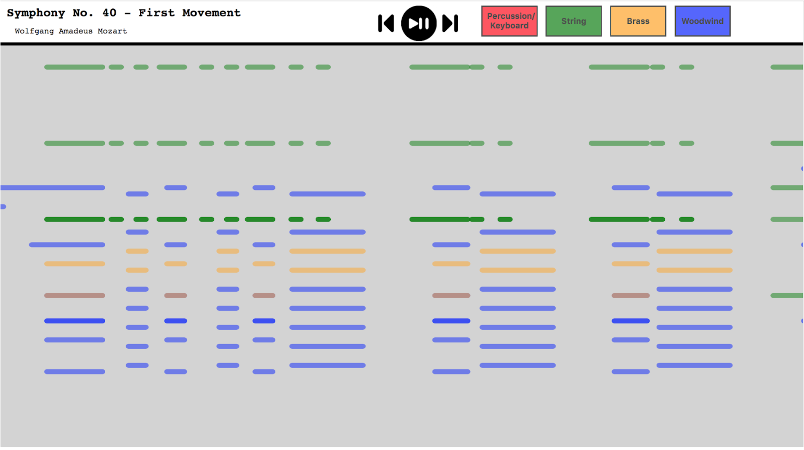

# MusicViz

A tool for visualizing music as animations using visualization variables for easier following of more complex pieces. Powered by [D3.js](https://d3js.org/) and [Tone.js](https://tonejs.github.io/). Tested mainly on Chrome.

